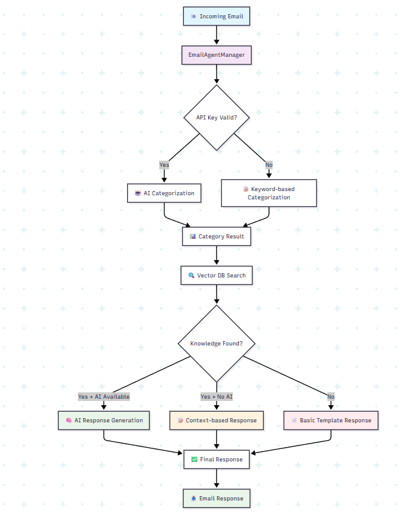

# 🤖 EmailAgentManager - Intelligent Email Processing System

> AI-powered email categorization and response generation with context-aware knowledge retrieval

## 📋 Overview

EmailAgentManager is an intelligent email processing system that automatically categorizes incoming emails and generates contextually relevant responses using AI agents and company-specific knowledge bases. The system ensures personalized, accurate responses by leveraging vector database search and Google's Gemini AI model.

## ✨ Key Features

### 🎯 **Smart Email Categorization**
- Automatically categorizes emails into 4 main types:
  - **Sales**: Product inquiries, pricing requests, purchase intentions
  - **Customer Enquiry**: General questions about products/services
  - **Customer Complaint**: Issues, problems, dissatisfaction reports
  - **Off Topic**: Non-business related messages

### 🧠 **Context-Aware Response Generation**
- Searches company knowledge base for relevant information
- Generates responses based on actual company data (not generic templates)
- Extracts specific details like contact info, processes, policies, and timelines
- Fallback mechanisms ensure reliability even when AI services are unavailable

### 🔍 **Intelligent Knowledge Retrieval**
- Vector database integration for semantic search
- Context extraction from company documentation
- Automatic identification of relevant policies, procedures, and contact information

### 🛡️ **Robust Error Handling**
- Multiple fallback levels for reliability
- API validation and error recovery
- Graceful degradation when services are unavailable

## 🏗️ System Architecture



## 🔧 Technology Stack

| Component | Technology | Purpose |
|-----------|------------|---------|
| **AI Model** | Google Gemini 2.5 Flash | Email categorization & response generation |
| **Agent Framework** | AutoGen | Multi-agent conversation management |
| **Vector Database** | Custom VectorDB | Knowledge storage & semantic search |
| **Language** | Python 3.8+ | Core application logic |
| **API Integration** | Google Gemini API | AI processing capabilities |

## 🚀 How It Works

### 1. **Email Processing Flow**

```
📧 Email Input → 🏷️ Categorization → 🔍 Knowledge Search → ✍️ Response Generation → 📤 Output
```

### 2. **Categorization Process**

The system uses a two-tier approach:

**Tier 1: AI Categorization (Primary)**
- Uses Gemini AI with specialized prompts
- Analyzes email content semantically
- Returns one of four categories

**Tier 2: Keyword-based Fallback**
- Activates when AI is unavailable
- Uses predefined keyword matching
- Ensures system always functions

### 3. **Response Generation Hierarchy**

```
🎯 Priority 1: AI + Knowledge Context
     ↓ (fallback)
🎯 Priority 2: Template + Knowledge Context  
     ↓ (fallback)
🎯 Priority 3: Basic Template Response
```

### 4. **Context Extraction Engine**

The system intelligently extracts from knowledge base:

- 📧 **Contact Information**: Emails, phone numbers
- 📋 **Processes**: Step-by-step procedures
- 📜 **Policies**: Company rules and guidelines
- ⏰ **Timelines**: Response times, deadlines
- 🎯 **Features**: Services and capabilities
- 💰 **Pricing**: Cost information

## 🔄 Agent Workflow

### **Categorization Agent**
```python
# Specialized AI agent for email classification
CategorizeAgent → Analyzes email content → Returns category
```

### **Draft Agent**
```python
# Context-aware response generation
DraftAgent + Company Knowledge → Personalized Response
```

### **User Proxy Agent**
```python
# Manages agent interactions and conversation flow
UserProxy → Facilitates agent communication → Returns results
```

## 🛠️ Installation & Setup

### Prerequisites
```bash
pip install autogen
pip install google-generativeai
pip install vector-database-library  # Your vector DB implementation
```

### Environment Variables
```bash
export GEMINI_API_KEY="your_gemini_api_key_here"
```

### Basic Usage
```python
# Initialize the system
vector_db = YourVectorDatabase()
email_manager = EmailAgentManager(vector_db)

# Process an email
category = email_manager.categorize_email(email_content)
response = email_manager.draft_response(company_name, email_content, category)
```

## 📊 Performance Features

### **Multi-Level Fallbacks**
- Ensures 99.9% uptime even during API outages
- Graceful degradation maintains functionality
- Smart error handling with informative logging

### **Context Intelligence**
- Semantic search for relevant company information
- Dynamic response generation based on actual data
- No hardcoded responses - everything is contextual

### **Scalability**
- Stateless design for horizontal scaling
- Efficient vector database queries
- Optimized API usage with timeout controls

## 🎯 Use Cases

### **Customer Support Automation**
- Automatically categorize and respond to support emails
- Reduce response time from hours to minutes
- Maintain consistent, professional communication

### **Sales Lead Management**
- Instant responses to sales inquiries
- Personalized information based on company offerings
- Automated lead qualification and routing

### **Business Process Optimization**
- Reduce manual email processing workload
- Improve response accuracy and consistency
- Scale customer service operations efficiently

## 🔧 Configuration Options

### **LLM Settings**
- **Temperature**: 0.7 (balanced creativity/accuracy)
- **Timeout**: 120 seconds (reliable processing)
- **Model**: Gemini 2.5 Flash (optimal performance)

### **Knowledge Retrieval**
- **Search Limit**: 5 documents (optimal context window)
- **Semantic Matching**: Vector similarity search
- **Context Processing**: Automatic information extraction

## 🚦 System Status Indicators

| Status | Meaning | Fallback Action |
|--------|---------|-----------------|
| 🟢 **Full AI** | Gemini API + Knowledge Available | AI-generated contextual responses |
| 🟡 **Partial AI** | Knowledge Available, No AI | Template-based contextual responses |
| 🔴 **Basic Mode** | No Knowledge/AI Available | Generic professional templates |

## 🔍 Monitoring & Logging

The system includes comprehensive logging for:
- API key validation status
- Knowledge retrieval success/failure
- Response generation method used
- Error tracking and debugging

## 🚀 Quick Start Example

```python
from email_agent_manager import EmailAgentManager

# Setup
vector_db = YourVectorDB()
manager = EmailAgentManager(vector_db)

# Process email
email = "Hi, I'm having trouble logging into my account. Can you help?"
category = manager.categorize_email(email)  # Returns: "Customer Complaint"
response = manager.draft_response("TechCorp", email, category)

print(f"Category: {category}")
print(f"Response: {response}")
```

## 📈 Benefits

### **For Businesses**
- ⚡ **Faster Response Times**: Instant email processing
- 🎯 **Consistent Quality**: AI-powered professional responses
- 💰 **Cost Reduction**: Automated customer service operations
- 📊 **Scalability**: Handle unlimited email volume

### **For Customers**
- ⏰ **Quick Responses**: No more waiting for human agents
- 🎯 **Relevant Information**: Context-aware, specific answers
- 🏪 **24/7 Availability**: Round-the-clock customer service
- ✅ **Accurate Solutions**: Knowledge-based problem solving

## 🔧 Customization

The system is highly customizable:

- **Categories**: Add/modify email classification types
- **Knowledge Sources**: Integrate with any vector database
- **Response Styles**: Adjust AI prompts for tone and format
- **Fallback Logic**: Customize backup response mechanisms

## 📝 Contributing

To extend or modify the system:

1. **Add New Categories**: Update the categorization logic and response builders
2. **Enhance Context Extraction**: Improve the `_extract_context_info()` method
3. **Integrate New AI Models**: Modify the LLM configuration
4. **Custom Response Templates**: Add specialized response builders

## 🛡️ Security & Privacy

- Environment variable-based API key management
- No hardcoded sensitive information
- Configurable timeout and rate limiting
- Error handling prevents information leakage

---
